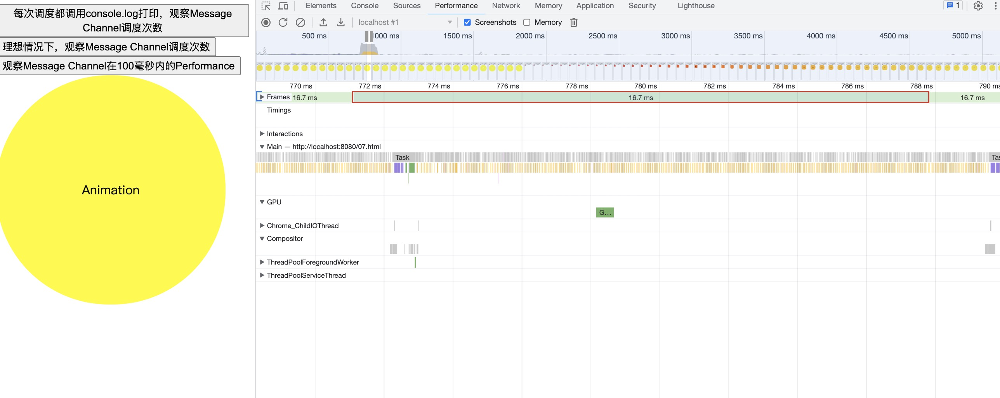

## 大纲

- 宏任务、微任务API都有哪些
- 同步更新、异步更新
- 为什么不使用setTimeout
- 为什么使用Message Channel
- 什么是任务切片？什么是时间切片

为什么需要异步调度？

我们在写代码时需要关注的几点：
- 不影响页面流畅度、比如动画
- 代码执行速度尽可能快


## 一个简单的动画
从一个简单的动画开始讲起

源码：[简单的动画](./01.html)

## 同步更新页面

源码：[同步更新](./02.html)

假设有3000个任务，每个任务执行耗时2毫秒，执行完这组任务理论上耗时6000毫秒。点击按钮时，执行这组任务。

分析：

点击按钮时，这组任务是同步执行的，所有任务执行完成，总共耗时差不多 6 秒，而在这个过程中，js 引擎一直占用着控制权，浏览器无法绘制页面，也无法响应用户，用户体验相当不好。所以，这组耗时长的任务不应该同步执行


## 使用setTimeout异步更新页面

源码：[setTimeOut异步更新页面](./03.html)

为了不长时间占用主线程，阻塞浏览器渲染，将任务放到 setTimeout 定时器里面执行，每个定时器执行一个任务。每执行一次都判断 works 是否全部执行完成，如果全部执行完成，则更新页面。每执行完一次任务，都主动将控制权让出给浏览器。

注意，我们在代码中使用settimeout调度时，间隔设置为0。
```js
setTimeout(workLoop, 0)
```

理论上，如果按照settimeout间隔0计算，3000个任务理论上执行完成总共耗时也就6000毫秒。但实际上我们耗时差不多是18秒，页面才更新


分析：

这次，我们的页面没有卡顿了，但是页面需要耗时18秒左右的时间才能更新。显然这是不能接受的。**我们在追求页面动画流畅、不卡顿的同时，应该还要快速响应用户的输入从而快速更新页面**。

实际上，虽然我们设置settimeout间隔为0，但是浏览器实际在调度时有至少 4 到 5 毫秒的延迟。在执行一组数量不限的任务时，这个耗时是不容忽视的。如果两次 setTimeout 之间最少间隔 4 毫秒，都有至少 3000 * 4 = 12000 毫秒的耗时了，加上6000毫秒的执行耗时，确实是差不过要18秒才能执行完全部的任务。


很显然，setTimeout并不适合用来做异步调度，那还有什么API能触发宏任务，同时调用间隔比较短呢？

>不使用 Promise 或者 MutationObserver 等微任务 API 的原因是，微任务是在页面更新前全部执行完成的，效果和同步执行任务差不多。

## MessageChannel基本使用

源码：[MessageChannel基本使用](./07.html)

理想条件下，MessageChannel 1秒内调度次数能达到十万多次，这取决于机器性能
```js
btn.onclick = () => {
    const startTime = new Date().getTime();
    let i = 0;
    var channel = new MessageChannel();
    var port = channel.port2;
    channel.port1.onmessage = work;
    function work() {
        if(Date.now() - startTime < 1000){
            i++
            console.log(i)
            port.postMessage(null);
        }else {
            console.log('完成i', i, Date.now() - startTime)
        }
    }
    port.postMessage(null);
};
```
如下图所示：每次调度都调用`console.log(i)`打印，此时Message Channel调度次数在两万多次


如果把`console.log(i)`注释掉，则MessageChannel调度能达到十万次，如下所示:


从下图可以看出Message Channel在一帧之内的调用次数：



## 使用MessageChannel异步更新页面

源码： [使用MessageChannel异步更新页面](./04.html)


使用 MessageChannel 触发一个宏任务，在宏任务事件中执行工作。每执行完一个工作，判断是否已经执行完全部的工作，如果是，则更新页面，否则调用port.postMessage(null)触发下一个宏任务，继续执行剩余的工作


点击按钮，可以发现耗时只用了 6000 毫秒左右，同时页面动画流畅，这组任务的执行丝毫不影响页面动画


观察 performance 可以看出，虽然两次宏任务之间间隔非常短，这里我们每个任务执行需要2毫秒，一帧大概16.6毫秒，观察每一帧可以发现，一帧内浏览器可以执行8个任务。实际上，如果不考虑我们的任务执行耗时，浏览器在一帧之内调度message channel的频率可以达到上万次


当然，message channel两次间隔虽然很短，但也会导致额外的开销，执行3000个任务，累积起来就有了几毫秒的差异。不过，这已经很贴近 6000 毫秒的执行耗时了，优势远胜于 setTimeout


这次我们能够同时兼顾页面动画流畅、不卡顿以及快速响应用户输入，尽早更新页面。但是还有一点小瑕疵，由于两次任务之间还是会有一点点的时间间隔，执行数量众多的任务时，这些间隔的时间就会累加起来，就会有几毫秒的额外开销。作为一个对速度有追求的切图仔，我们应该尽可能压榨一下浏览器


## 任务切片：一次宏任务事件尽可能执行更多的任务

源码：[任务切片：一次宏任务尽可能执行更多的任务](./05.html)

在上一节中，额外消耗的时间等于两次宏任务之间的时间间隔 * 工作的数量：

```js
额外消耗的时间 = 两次宏任务之间的时间间隔 * works.length;
```

显然，我们无法控制两次宏任务之间的时间间隔，但是我们可以减少触发宏任务事件的次数。可以通过在一次宏任务事件中执行更多的任务来达到这个目的。同时，一次宏任务事件的执行耗时又不能超过 1 帧的时间(16.6ms)，毕竟我们需要留点时间给浏览器绘制页面

因此，我们需要在一次宏任务事件中尽可能多的执行任务，同时又不能长时间占用浏览器。为了达到这个目的，我们将任务拆分成几小段执行，即**任务切片**。既然一帧 16.6 毫秒，执行一次任务需要 2 毫秒，那只需要在一次宏任务事件中执行 7 个任务就好，这样浏览器还有 2.6 毫秒绘制页面


从上图可以看出，一帧之内只调度了一次。我们采用任务切片的方法极大减少了触发 message channel 的次数，减少了宏任务之间调度的额外消耗。但是这里还有个问题，任务切片的一个前提是，每个任务执行耗时是确定的，比如这里是 2 毫秒，但真实的业务场景是无法知道任务的执行耗时的，因此我们很难判断该如何将任务进行切片，本例中我们采用的是 7 个任务一个片段，那如果一个任务的执行耗时不确定，我们又怎么设置这个片段的大小？可想而知，任务切片虽然理想，但不太现实


## 时间切片

源码：[时间切片](./06.html)

我们来探讨一种时间切片的方式。我们知道浏览器一帧只有 16.6ms，同时我们的工作执行耗时又不是确定的。那我们是不是可以，将一次宏任务的执行时间尽可能的控制在一定的时间内，比如 5ms。在当前的宏任务事件内，我们循环执行我们的工作任务，每完成一个工作任务，都判断执行时间是否超出了 5 毫秒，如果超出了 5 毫秒，则不继续执行下一个工作任务，结束本轮宏任务事件，主动让出控制权给浏览器绘制页面。如果没有超过 5 毫秒，则继续执行下一个工作任务


这次，我们采用时间切片的方式，每个宏任务事件最多执行 5ms，超过 5ms 则主动结束执行，让出控制权给浏览器。时间切片的好处就是我们不用关心每个任务的执行耗时。比如，这里我们用随机的方法，让每个工作任务执行耗时在 0-1 毫秒之间。

```js
let works = [];
for (let i = 0; i < 3000; i++) {
  works.push(() => {
    const start = performance.now();
    const time = Math.random();
    while (performance.now() - start < time) {}
  });
}
```


至此，似乎我们的目标已经达成：在尽可能短的时间内完成耗时长的一组工作任务，同时又不会长时间占用浏览器，让浏览器处理高优先级的任务，比如响应用户输入、绘制页面等

## 小结
到目前为止，效果还是很不错的，我们学到了：
- 耗时长的同步任务会长时间占用浏览器导致无法响应用户输入，页面卡顿等问题
- setTimeout 由于有至少 4 毫秒的延迟，因此不适合用于异步任务的调度
- MessageChannel 在一帧的时间内调用频率超高，两次 message channel 宏任务事件之间的间隔开销极少，适合用于异步任务的调度。
- 由于无法提前得知任务执行时间，从而无法计算一帧之内应该执行几个任务，所以任务切片不太适用于一帧内调度异步任务。
- 时间切片是比较理想的选择


## 封装
目前为止，我们的works任务都是固定的，不够通用。因此我们需要封装成一个专门用于调度的小工具。

首先，将Message Channel 抽成一个公用的调度方法
```js
const yieldInterval = 5;
let deadline = 0;
const channel = new MessageChannel();
let port = channel.port2;
channel.port1.onmessage = performWorkUntilDeadline;
function performWorkUntilDeadline() {
  if (scheduledHostCallback) {
    // 当前宏任务事件开始执行
    let currentTime = new Date().getTime();
    // 计算当前宏任务事件结束时间
    deadline = currentTime + yieldInterval;
    const hasMoreWork = scheduledHostCallback(currentTime);
    if (!hasMoreWork) {
      scheduledHostCallback = null;
    } else {
      // 如果还有工作，则触发下一个宏任务事件
      port.postMessage(null);
    }
  }
}
function requestHostCallback(callback) {
  scheduledHostCallback = callback;
  port.postMessage(null);
}

```

我们通过 requestHostCallback 触发一个 message channel 事件，同时在 performWorkUntilDeadline 接收事件，这里需要注意，我们必须在 performWorkUntilDeadline 开始时获取到当前的时间 currentTime，然后计算出本次事件执行的截止时间，performWorkUntilDeadline 的执行时间控制在 5 毫秒内，因此截止时间就是 deadline = currentTime + yieldInterval;

如果 scheduledHostCallback 返回 true，说明还有剩余的工作没完成，则调度下一个宏任务事件执行剩余的工作。


其次，我们需要一个 scheduleCallback 方法给用户添加任务，我们将用户添加的任务保存在 taskQueue 中。然后触发一个 message channel 事件，异步执行任务。

```js
let taskQueue = [];
let isHostCallbackSchedule = false;
function scheduleCallback(callback) {
  var newTask = {
    callback: callback,
  };
  taskQueue.push(newTask);
  if (!isHostCallbackScheduled) {
    isHostCallbackScheduled = true;
    requestHostCallback(flushWork);
  }
  return newTask;
}

```

最后需要实现 flushwork 方法，在 workLoop 方法中，每执行一个工作，都需要判断当前 performWorkUntilDeadline 事件执行时间是否超过 5ms

```js
let currentTask = null;
function flushWork(initialTime) {
  return workLoop(initialTime);
}

function workLoop(initialTime) {
  currentTask = taskQueue[0];

  while (currentTask) {
    if (new Date().getTime() >= deadline) {
      // 每执行一个任务，都需要判断当前的performWorkUntilDeadline执行时间是否超过了截止时间
      break;
    }
    var callback = currentTask.callback;
    callback();

    taskQueue.shift();
    currentTask = taskQueue[0];
  }
  if (currentTask) {
    // 如果taskQueue中还有剩余工作，则返回true
    return true;
  } else {
    return false;
  }
}

```

然后我们就可以这样使用：

```js
const A = () => {
      console.log('A')
      const start = Date.now();
      while (Date.now() - start < 2) { }
}
const B = () => {
    console.log('B')
    const start = Date.now();
    while (Date.now() - start < 3) { }
}
const C = () => {
    console.log('C')
    const start = Date.now();
    while (Date.now() - start < 4) { }
}
const D = () => {
    console.log('D')
    const start = Date.now();
    while (Date.now() - start < 2) { }
}
btn.onclick = () => {

    scheduleCallback(A)
    scheduleCallback(B)
    scheduleCallback(C)
    scheduleCallback(D)
};
```

使用Scheduler改造一开始的例子：
```js
btn.onclick = () => {
    startTime = new Date().getTime();
    for (let i = 0; i < 3000; i++) {
        if (i === 2999) {
            scheduleCallback(() => {
                const start = new Date().getTime();
                while (new Date().getTime() - start < 2) { }
                const endTime = new Date().getTime();
                animate.innerHTML = endTime - startTime;
            });
        } else {
            scheduleCallback(() => {
                const start = new Date().getTime();
                while (new Date().getTime() - start < 2) { }
            });
        }
    }
};
```


最终的源码：[Scheduler Demo](./08.html)、[Scheduler精华实现](./08.js)